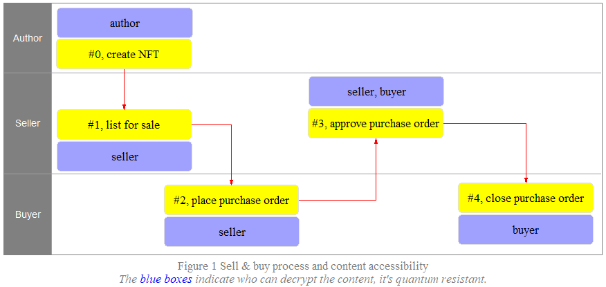
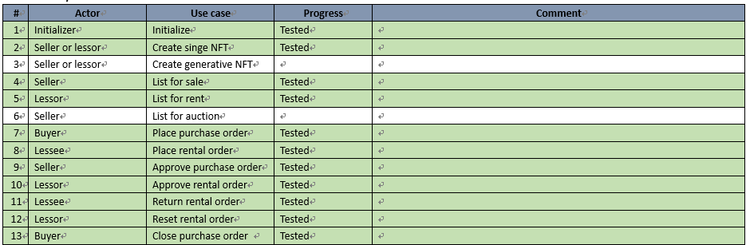

# I Own It Forever (IOIF)

#### *If you are interested in this project, please leave a comment!*

## **1 Do you really own an NFT?**

 

NO! YOU DON’T. What’s stored on chain is a link in the form of plaintext which points to a JSON file stored on some storage chain or something else, like Arweave, IPFS etc, which contains other links one of wich points to the real content that’s usually stored on the same storage. This is how an NFT’s content is sotred on all block chains currently in this world. It can be easily plgairized, anyway YOUR OWNERSHIP IS NOT PROTECTED AT ALL, LET ALONE BORROWERSHIP. 

Currently, if you created an NFT, doesn’t mean you own it really, in nature, it’s only equivalent to a certificate, but unfortunately it’s not issued by an international authority, technically just a link a ssociated with a unique token, but both the link and the content it points to are publicly available, that’s why your NFTs can be stolen without fear of law. 

We are going to change this forever for anyone who creates an NFT or has bought an NFT or has rented an NFT temporarily! And the content may be anything you can imagine.

## 2 Really?

DO YOUR OWN LITTLE RESEARCH YOU WILL BE CONVINCED. The easiest way to plagiarize is right-click-and-save, technically, a block chain developer can plagiarize all NFTs in this world, sicne all the links are publicly available, just with some technical work, this is not an exageration at all! The following few links are just a tiny tip of a huge ice burg about how bad the situation is.

[‘Huge mess of theft and fraud:’ artists sound alarm as NFT crime proliferates](https://www.theguardian.com/global/2022/jan/29/huge-mess-of-theft-artists-sound-alarm-theft-nfts-proliferates)

[Thieves Steal Gallery Owner’s Multimillion-Dollar NFT Collection: ‘All My Apes Gone’](https://www.artnews.com/art-news/news/todd-kramer-nft-theft-1234614874/)

[NFT Theft - TOP 7 Techniques | How to Protect NFT Artwork](https://www.youtube.com/watch?v=-Dpgp9ZPMWw)

 

## 3 Business Vision

Paying is the only way of owning some digital product on **IOIF**. What you pay is either the work of authoring the NFT content or you’ve bought it, no other ways to own an NFT. WE TRULY SHAFT THE OWNERSHIP AND BORROWERSHIP!

## 4 How to solve?

- One type of links for demo only with low quality content, publicly available, just as-is still stick to ERC721.
- The other type of links for full quality content, its soruce files and metadata as well, all encrypted with quantum resistant technologies, this is absolutely private.

Take sell/buy process as an example:

## 5 Roadmap

| Stage | Chain    | Desktop       | Website     | SDK/API                |
| ----- | -------- | ------------- | ----------- | ---------------------- |
| 1     | Solana   | seller/buyer  | list, index | selling/buying in game |
| 2     | Ethereum | seller/buyer  | list, index | selling/buying in game |
| 3     | Cardano  | seller/buyer  | list, index | selling/buying in game |
| 4     | Solana   | lessor/lessee | list, index | renting in game        |
| 5     | Ethereum | lessor/lessee | list, index | renting  in game       |
| 6     | Cardano  | lessor/lessee | list, index | renting in game        |
| 7     | Solana   | auction       | list, index | auction in game        |
| 8     | Ethereum | auction       | list, index | auction in game        |
| 9     | Cardano  | auction       | list, index | auction in game        |

## 6 Progress

Currently Solana only, I've developed and tested the program on Solana.

